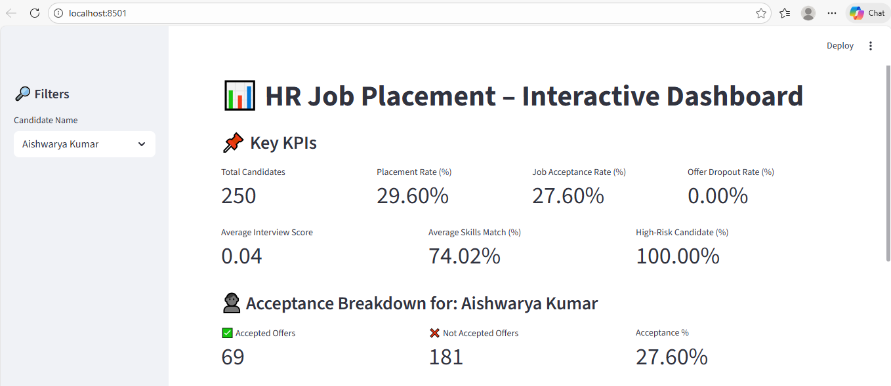

# Talent Acquisition Analytics Dashboard

## 🎯 Project Overview

An end-to-end analytics solution that transforms HR placement data into actionable insights for talent acquisition teams. This project demonstrates the complete analytical workflow from data exploration to predictive modeling and interactive dashboard development.

**Business Problem:** Organizations struggle to optimize their hiring processes due to limited visibility into placement success factors, candidate risk indicators, and interview performance patterns.

**Solution:** Built a comprehensive analytics platform that tracks critical hiring KPIs, identifies high-risk candidates, and provides data-driven recommendations to improve placement rates and reduce offer dropouts.

---

## 📊 Key Business Insights & KPIs

The dashboard tracks and visualizes:

- **Placement Rate:** Percentage of candidates successfully placed in positions
- **Job Acceptance Rate:** Proportion of offers accepted by candidates
- **Average Interview Score:** Performance metrics across interview stages
- **Skills Match Percentage:** Alignment between candidate skills and job requirements
- **Offer Dropout Rate:** Critical metric for identifying process bottlenecks
- **High-Risk Candidate Identification:** Predictive flagging of candidates likely to decline offers

---

## 🔍 Analytical Approach

### 1. **Exploratory Data Analysis (EDA)**
- Analyzed placement patterns across different company tiers and competition levels
- Investigated correlations between interview scores, skills match, and placement outcomes
- Identified key factors influencing job acceptance decisions
- Segmented candidates by risk profiles

### 2. **Data Preprocessing & Feature Engineering**
- Implemented smart column mapping to handle data inconsistencies
- Created derived features to capture meaningful patterns:
  - Risk scoring based on multiple factors
  - Performance composite metrics
  - Categorical encoding for company tiers and competition levels
- Handled missing values and outliers using statistical methods

### 3. **Predictive Modeling**
- Built classification models to predict placement success
- Developed risk assessment algorithms for candidate dropout prediction
- Validated models using cross-validation and performance metrics

### 4. **Interactive Dashboard**
- Designed user-friendly Streamlit interface for stakeholder access
- Implemented drill-down capabilities for detailed candidate analysis
- Created dynamic visualizations for trend analysis and KPI monitoring

---

## 💡 Business Impact

**For HR Teams:**
- Reduced time spent on manual reporting by automating KPI tracking
- Early identification of at-risk candidates enables proactive intervention
- Data-driven insights support better hiring decisions

**For Hiring Managers:**
- Clear visibility into interview performance and candidate quality
- Benchmarking capabilities across different positions and company tiers
- Actionable recommendations for process improvements

---

## 🛠️ Technical Stack

**Programming & Analysis:**
- Python 3.x
- Pandas (Data manipulation & analysis)
- NumPy (Numerical computations)

**Visualization:**
- Matplotlib & Seaborn (Statistical visualizations)
- Streamlit (Interactive dashboard)

**Machine Learning:**
- Scikit-learn (Predictive modeling & preprocessing)

**Development Tools:**
- Git & GitHub (Version control)
- Jupyter Notebooks (Exploratory analysis)

---

## 📁 Project Structure

```
HR-Job-Placement-Analysis/
│
├── Data_Clean_Preprocess.py       # Data cleaning and preprocessing pipeline
├── EDA_Analyst_Tasks.py           # Analysis of analyst-specific metrics
├── EDA_Company_Tier.py            # Company tier performance analysis
├── EDA_Competition_Level.py       # Competition impact analysis
├── EDA_Correlation.py             # Correlation and relationship analysis
├── Feature_Engineering.py         # Feature creation and transformation
├── Model_Training.py              # Machine learning model development
├── Streamlit_App.py               # Interactive dashboard application
├── requirements.txt               # Project dependencies
└── README.md                      # Project documentation
```

---

## 🚀 Getting Started

### Prerequisites
- Python 3.8 or higher
- pip package manager

### Installation

1. **Clone the repository**
```bash
git clone https://github.com/priyanshyou/Talent-Acquisition-Analytics-Dashboard
.git
cd Talent-Acquisition-Analytics-Dashboard

```

2. **Install required packages**
```bash
pip install -r requirements.txt
```

3. **Run the Streamlit dashboard**
```bash
streamlit run Streamlit_App.py
```

The dashboard will open automatically in your default web browser at `http://localhost:8501`

---

## 📸 Dashboard Preview



The interactive dashboard provides:
- Real-time KPI monitoring
- Candidate-level drill-down capabilities
- Trend analysis and historical comparisons
- Exportable reports for stakeholder presentations

---

## 🔄 Future Enhancements

- **Time Series Analysis:** Track hiring trends over time and forecast future placement rates
- **Advanced ML Models:** Implement ensemble methods for improved prediction accuracy
- **A/B Testing Framework:** Evaluate the impact of process changes on placement outcomes
- **Integration Capabilities:** Connect with ATS (Applicant Tracking Systems) for real-time data
- **Automated Reporting:** Schedule and email KPI reports to stakeholders
- **Segmentation Analysis:** Deep-dive into performance by department, role type, or geography

## 📈 Key Learnings

- Successfully translated raw HR data into actionable business insights
- Developed end-to-end analytical workflow from data collection to dashboard deployment
- Gained experience in stakeholder communication through visualization design
- Applied statistical methods and machine learning to solve real-world business problems
- Learned best practices in data pipeline development and code organization


## 🙏 Acknowledgments

- Dataset inspired by real-world HR placement challenges
- Streamlit community for excellent documentation and examples
- Open-source Python data science community

